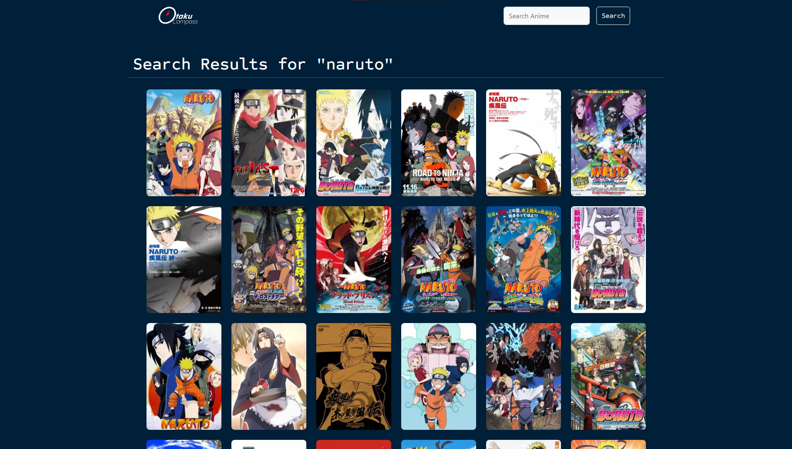

# Otaku Compass

This is a web application built with Node.js, Express, and EJS that allows users to search for anime using the Jikan API. Users can also view random anime and detailed information about specific anime titles.


## Screenshots





## Deployment

1. Clone the repository:
```bash
  npm run deploy
```
2. Navigate to project directory: 

```bash
cd Otaku-Compass

```
3. Install Dependencies

```bash
  npm install
```
To deploy this project run

```bash
  node index.js
```

## Features

- Search for anime by title.
- View random anime.
- View detailed information about specific anime titles.
